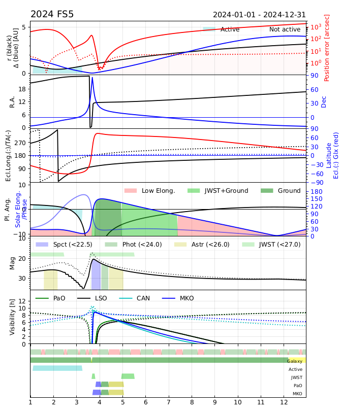

# hrzVisibility
For a solar system object and a period of time, get the object's ephemerides from  JPL Horizons, and display them as a (complex) plot showing the visibility and observability of the object.

It uses astroquery.jplhorizons to get the ephemerides from JPL.
The plots are taylored for my observing programs...

```
usage: Visibility.py [-h] [-f OUTFILE] [-o OBJECT] [-s START] [-e END] [-d DELTAMAX]

options:
  -f OUTFILE, --outFile OUTFILE
                        Root of the output file (no extension)
  -o OBJECT, --object OBJECT
                        Designation of the object; must be resolved by Horizon; in case of doubt use the Unique JPL ID (in the ephem header, 1st line Rec #:
  -s START, --start START
                        Start time, YYYY-MM-DD
  -e END, --end END     End time, a YYYY-MM-DD
  -d DELTAMAX, --deltaMax DELTAMAX
                        Max value of Delta for plot; leave to 0 for auto.
```

Example:



